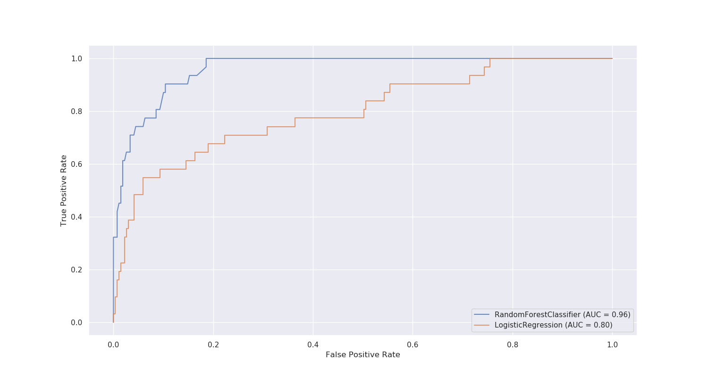
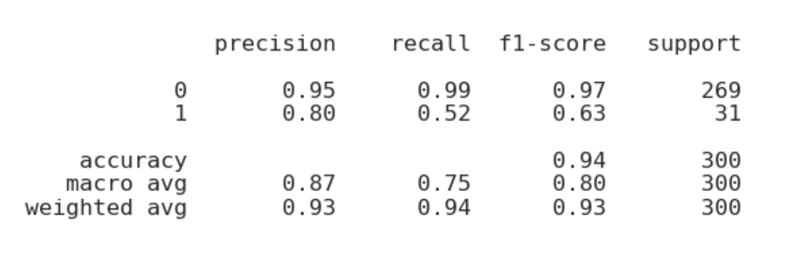
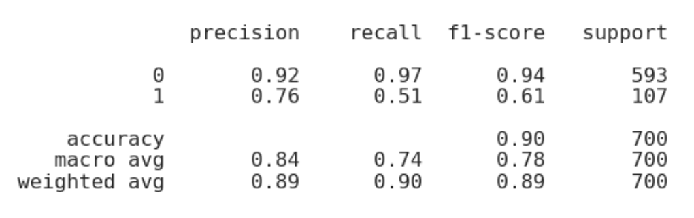
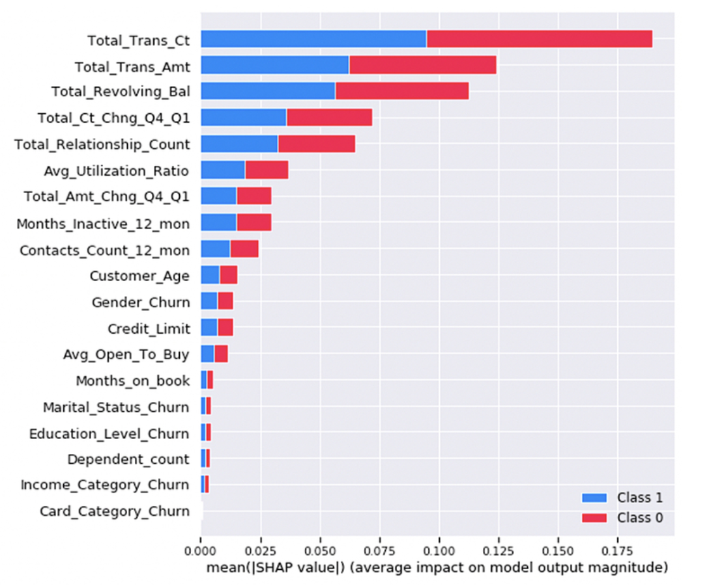
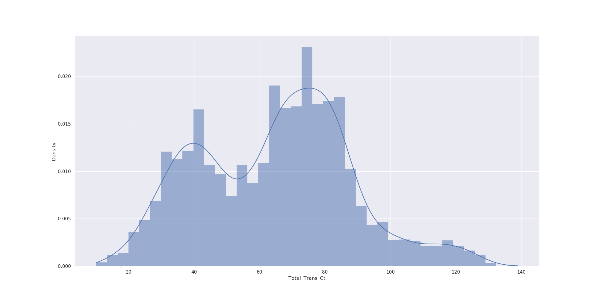

<a name="readme-top"></a>


# Predict Customer Churn [](https://www.paypal.com/cgi-bin/webscr?cmd=_s-xclick&hosted_button_id=EFQXNQ7UYXYKW&source=url)

<details>
  <summary>Table of Contents</summary>
  <ol>
    <li>
      <a href="#project-description">Project description</a>
    </li>
    <li>
      <a href="#files-and-data-description">Files and data description</a>
    </li>
    <li>
      <a href="#models">Models</a>
      <ul>
        <li><a href="#metrics">Metrics</a></li>
        <li><a href="#features">Features</a></li>
      </ul>
    </li>
    <li>
      <a href="#getting-started">Getting Started</a>
      <ul>
        <li><a href="#requirements">Requirements</a></li>
        <li><a href="#usage">Usage</a></li>
        <li><a href="#running">Running</a></li>
      </ul>
    </li>
    <li><a href="#unit-testing">Unit Testing</a></li>
    <li><a href="#acknowledgments">Acknowledgments</a></li>
    <li><a href="#issues">Issues</a></li>
    <li><a href="#license">License</a></li>
  </ol>
</details>

## Project description

This project seeks to identify credit card customers that are most likely to churn.

Customer churn is the occurrence of customers discontinuing their usage of a product or service or leaving a business.
Predicting it allows for targeted interventions (such as special discounts or follow-ups) to customers which are likely
to churn in the near future. The cost of lost revenue is usually much greater than any discounts that could be offered.
The task was to predict which customers are likely to churn in the near future.

:star2: Highlights:

1. The project follows coding (PEP8) and engineering best practices for implementing software (modular, documented and
   tested).
2. The model has outstanding accuracy and good sensitivity.
3. Methods of Explainable AI (XAI) ensure the model is not just a black box but makes transparent and reliable
   decisions. This facilitates trust in the predictions and makes them more accountable.

On the backend predictions are made using <u>two models</u>:

1. `Random Forest` classifier


2. `Logistic Regression` classifier

## Files and data description

**File structure:**

```
.
├── churn_library.py                   # Main
├── churn_notebook.ipynb               # Code before refactoring
├── churn_script_logging_and_tests.py  # Unit tests module
├── data                               # Data 
│   └── bank_data.csv                      # Data source in csv format
├── Guide.ipynb                        # Getting started and troubleshooting
├── images                             # Generated images 
│   ├── eda                                # Exploratory Data Analysis
│   └── results                            # Results from training
├── logs		               # Stored logs
│   └── churn_library.log                  # Log-file from running unit test
├── models                             # Stored models
│   ├── logistic_model.pkl                 # Logistic regression model
│   └── rfc_model.pkl                      # Random forest model
├── * README.md                        # Project overview and instructions
├── requirements_py3.6.txt             # Python 3.6 module requirements
└── requirements_py3.8.txt             # Python 3.8 module requirements
```

<p align="right">(<a href="#readme-top">back to top</a>)</p>

## Models

### Metrics

Overall the `Random Forest` model seems to have better performance as is visible in the ROC plot:



The `Random Forest` forest has a weighted average F1-score of 0.93.




The `Logistic regression` forest has a slightly lower weighted average F1-score of 0.89.




Both models display a better performance on the majority class, which is to be expected.

### Features

To ensure the model makes transparent predictions methods of explainable AI (XAI) were used.

One such method is the feature importance through ```Shapley``` values:



According to this analysis the most impactful feature is the total transaction count in the last 12
months```Total_Trans_Ct```. This feature follows a bimodal distribution.



The second most important is the total transaction amount. On the third place is the revolving balance.

<p align="right">(<a href="#readme-top">back to top</a>)</p>

## Getting started

### Requirements

Make sure all module requirements are met or install them with:

~~~
python -m pip install -r requirements_py3.6.txt
~~~

or alternatively for ```python==3.8```

~~~
python -m pip install -r requirements_py3.8.txt
~~~

### Usage

The main code can be found in ```churn_library.py```.

Upon **execution**:

1. The dataset ```/data/bank_data.csv``` is imported
2. Exploratory Data Analysis (EDA) will be performed
3. all categorical variables will be encoded with the proportion of churn
4. the dataset is split (feature engineering)
5. the models are trained
6. all results, graphics and models are saved and stored

### Running

The program can be run interactively:

~~~
ipython churn_library.py 
~~~

or also purely from the command line (CLI):

~~~
python churn_library.py 
~~~

<p align="right">(<a href="#readme-top">back to top</a>)</p>

## Unit testing

This project is built with unit tests which also log any errors, info and warning messages to a log file.

To test all functions and log the respective results, please run:

~~~
ipython churn_script_logging_and_tests.py 
~~~

To test a single function ```function_of_interest``` run:

~~~
pytest -v churn_script_logging_and_tests.py::function_of_interest
~~~

The argument ```-v``` is optional to see which function was tested

<p align="right">(<a href="#readme-top">back to top</a>)</p>

## Acknowledgments

* The dataset is open source and stems from LEAPS Analyttica. It consists of 10,000 customers mentioning their age,
  salary, marital_status, credit card limit, credit card category, etc.
* The project is part of the ML DevOps Engineer Udacity Nanodegree.

## Issues

Found a bug? Want more features? Find something missing in the documentation? Let me know! Please don't hesitate
to [file an issue](https://github.com/thierrygrimm/CustomerChurn/issues/new) and make a recommendation.

## License

```
Customer Churn - Modeling of customer churn in credit card data

The MIT License (MIT)

Copyright (c) 2023 Thierry Grimm

Permission is hereby granted, free of charge, to any person obtaining a copy
of this software ("Customer Churn") and associated documentation files (the "Software"), to deal
in the Software without restriction, including without limitation the rights
to use, copy, modify, merge, publish, distribute, sublicense, and/or sell
copies of the Software, and to permit persons to whom the Software is
furnished to do so, subject to the following conditions:

The above copyright notice and this permission notice shall be included in
all copies or substantial portions of the Software.

THE SOFTWARE IS PROVIDED "AS IS", WITHOUT WARRANTY OF ANY KIND, EXPRESS OR
IMPLIED, INCLUDING BUT NOT LIMITED TO THE WARRANTIES OF MERCHANTABILITY,
FITNESS FOR A PARTICULAR PURPOSE AND NONINFRINGEMENT. IN NO EVENT SHALL THE
AUTHORS OR COPYRIGHT HOLDERS BE LIABLE FOR ANY CLAIM, DAMAGES OR OTHER
LIABILITY, WHETHER IN AN ACTION OF CONTRACT, TORT OR OTHERWISE, ARISING FROM,
OUT OF OR IN CONNECTION WITH THE SOFTWARE OR THE USE OR OTHER DEALINGS IN
THE SOFTWARE.
```
